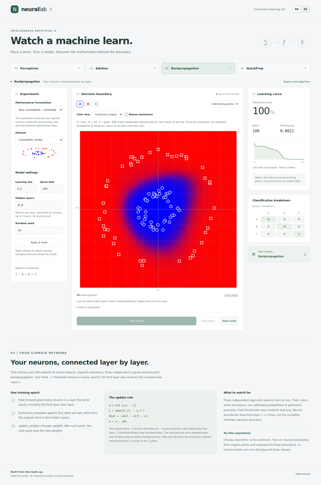

# Neural Lab · Inteligencia Artificial II

Pablo Escamilla's interactive neural-learning coursework, with a bilingual interface and verified simulations.



## Run / Ejecutar

Node.js 22+:

```bash
npm ci
npm start
```

Open **http://127.0.0.1:4173**. Static HTML, CSS and JavaScript; no runtime dependencies or external scripts. Serve over HTTP rather than opening the file directly.

## Your coursework is the default

The **Mathematical formulation** selector starts at **Your coursework · corrected**. It preserves the original neuron objects, sigmoid functions, fixed −1 thresholds, three NN outputs, squared-error backpropagation, per-point updates, and names such as `errorAcumulado`, `getSigma`, `prev_s` and `prev_g`.

Necessary corrections are explicit: sigmoid Adaline uses reachable 0/1 targets; forward propagation no longer mutates inputs; all output errors are counted correctly; QuickProp uses gradients of the same dataset objective with safe secant steps. The fixed threshold is retained because it is mathematically valid.

**Revised alternatives** keeps the first revamp's classical linear Adaline and tanh/softmax networks. Switching the formulation resets the model and changes its explanation. [Read the exact fidelity comparison and remaining differences](docs/fidelity.md).

## The continuous gradient is back

- Adaline and Perceptron show two-sided color intensity from the raw linear score.
- Coursework networks mix all three sigmoid outputs as RGB, without normalizing them: A blue, B red, C green.
- Revised networks blend softmax outputs.
- **Winning class** provides an optional discrete view.
- **Inspect prediction** shows the actual score or all output values.
- **Neuron boundaries** overlays first-layer zero-activation lines. Space cycles the selected class while the plot has focus.

Colors show model responses, not geometric distance to training examples. Independent sigmoid outputs are not normalized or calibrated probabilities. Both points and labels identify the classes consistently.

Choose a dataset, edit settings with **Apply & reset**, train, pause, step one epoch, or reset. Click to add labeled points, or use exact coordinate entry. Coursework networks retain three output classes in custom mode. Accuracy, loss and confusion matrices describe the training points, not unseen-data performance.

## Tests

```bash
npx playwright install --with-deps chromium
npm run test:math
npm test
npm run test:report
```

Playwright starts the server automatically. `npm run test:ui` opens its interactive runner. If needed, point `PLAYWRIGHT_CHROMIUM_EXECUTABLE_PATH` to an existing Chromium executable.

The suites cover both formulations, original-code equivalence at the neuron/update level, finite-difference gradients, learning on linear/XOR/circle/three-class data, continuous canvas colors, controls, translation, and mobile layouts. GitHub Actions runs the suites on pushes and pull requests and retains reports/traces. Local verification is documented in [validation.md](docs/validation.md); a configured workflow alone is not a claim of a completed hosted CI run.

## Source map

| File | Purpose |
| --- | --- |
| `src/coursework.js` | Adapted original classes and corrected coursework models |
| `src/models.js` | Revised alternatives, datasets and metrics |
| `src/colors.js` | Continuous colors and robust boundary clipping |
| `src/app.js` | UI, rendering and training lifecycle |
| `src/content.js` | Bilingual interface and revised explanations |
| `src/coursework-content.js` | Bilingual explanations of the original math and corrections |
| `tests/` | Browser, fidelity and numerical checks |

Original directories retain their scripts and `legacy.html`. Their `index.html` URLs redirect to the corresponding modern simulation. Archived pages retain historical bugs and CDN dependencies and are not the maintained application.

## Español

La versión predeterminada es **Tu código original · corregido**. Conserva tu estructura de neuronas, sigmoides, umbrales fijos −1, tres salidas, retropropagación por punto y nombres como `errorAcumulado`. Las correcciones matemáticas están documentadas en la interfaz y en [la comparación de fidelidad](docs/fidelity.md).

**Alternativas revisadas** permite elegir Adaline lineal clásico o las redes tanh/softmax. La explicación cambia junto con el modelo. **EN / ES** traduce la interfaz y las explicaciones sin reiniciar el entrenamiento.

Se recuperan los gradientes de intensidad y la mezcla RGB de las tres salidas. Representan la respuesta del modelo, no distancia a los ejemplos. Las sigmoides independientes no son probabilidades normalizadas. Puedes mostrar las fronteras de la primera capa, consultar las salidas numéricas y cambiar de clase con Espacio al enfocar el plano.

Las pruebas comparan operaciones con tu código original y verifican aprendizaje, gradientes, colores continuos, controles y traducción en Chromium de escritorio y con viewport móvil. Son pruebas de escenarios concretos, no garantías universales de convergencia ni pruebas en dispositivos físicos.
